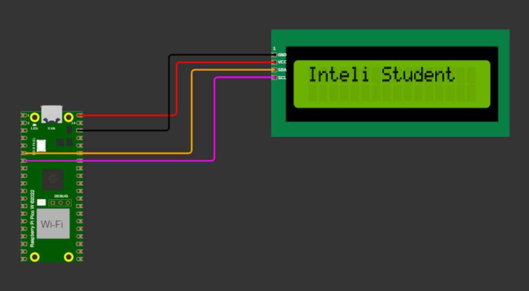
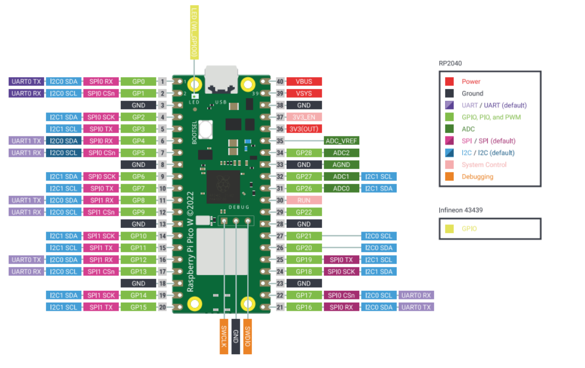
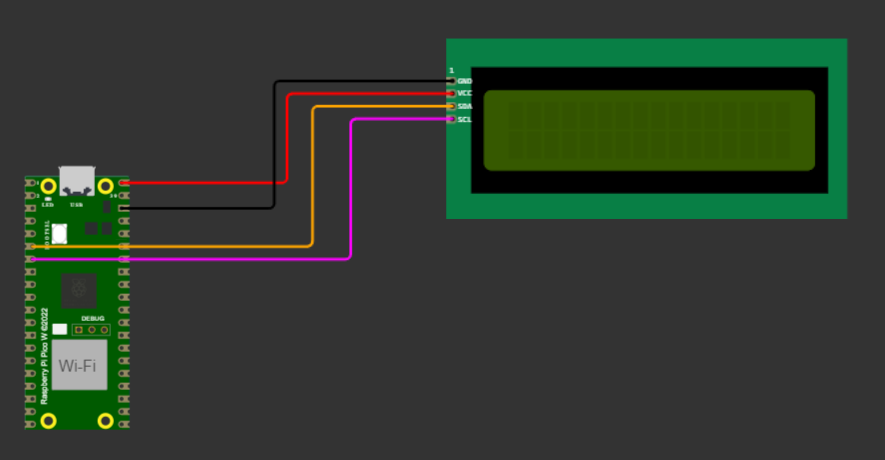

# Projeto LCD Raspberry Pi Pico W

Este projeto demonstra o uso de um LCD 16x2 com o Raspberry Pi Pico W, utilizando a interface de comunicação I2C.

## O projeto

O Raspberry Pi Pico W é uma plataforma robusta e de baixo custo, projetada para aplicações embarcadas, alcançando um equilíbrio entre desempenho e consumo de energia.

- **Características Técnicas:** O Pico W é centrado no microcontrolador RP2040 e suporta interfaces sem fio de banda única de 2,4 GHz, incluindo 802.11n para Wi-Fi e Bluetooth 5.2. Possui uma arquitetura de alimentação flexível e 26 pinos GPIO multifuncionais.

- **Interfaces de Comunicação:** O dispositivo oferece várias interfaces de comunicação, cruciais para sua funcionalidade e versatilidade, permitindo conectar e interagir com vários dispositivos externos, sistemas e redes.

- **Caso de Uso com Display I2C:** Foi realizado um caso de teste prático usando o protocolo I2C com um display LCD 16x2.

## Conteúdo do Repositório

- `main.py`: O arquivo de entrada da aplicação, inicializando a configuração do hardware e acionando o processo de exibição.
- `app_lcd.py`: Contém a lógica da aplicação para exibir mensagens no LCD.
- `i2c_lcd.py`: Gerencia a comunicação I2C entre o Pico W e o LCD. Originado do [repositório RPI-PICO-I2C-LCD de T-622](https://github.com/T-622/RPI-PICO-I2C-LCD/).
- `lcd_api.py`: Uma API genérica para controle de LCD, originada do [repositório python_lcd de dhylands](https://github.com/dhylands/python_lcd/).
- `diagram.json`: Diagrama da simulação Wokwi do projeto.

## Configuração e Uso

Carregue os arquivos do repositório em um novo projeto Raspberry Pi Pico W no Wokwi. O diagrama abaixo ilustra a configuração de hardware para o projeto. https://wokwi.com/projects/new/pi-pico-w

## Créditos e Agradecimentos

- [T-622/RPI-PICO-I2C-LCD](https://github.com/T-622/RPI-PICO-I2C-LCD/) - Script original `i2c_lcd.py`.
- [dhylands/python_lcd](https://github.com/dhylands/python_lcd/) - Script original `lcd_api.py`.

## Licença

Licença MIT (MIT). Consulte o arquivo [LICENSE](LICENSE) para obter mais informações.
